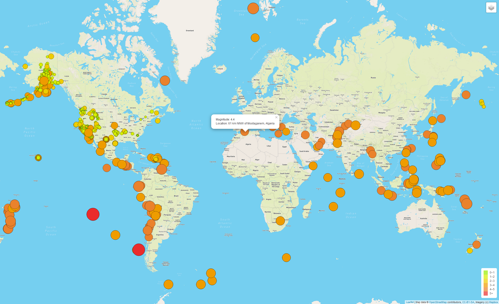

# Mapping-Earthquakes

## Description
Utilizes D3.js to retrieve the most recent earthquake data hosted on usgs.gov/earthquakes. This data is then formatted and visualized on a map of the whole world, with layer features added to change the map style, display tectonic plates, or only show major earthquakes. The color and style of the earthquake on the map is based upon the magnitude of the earthquake.

## Examples

#### Full Map

#### Major Earthquake Filter on Dark mode

